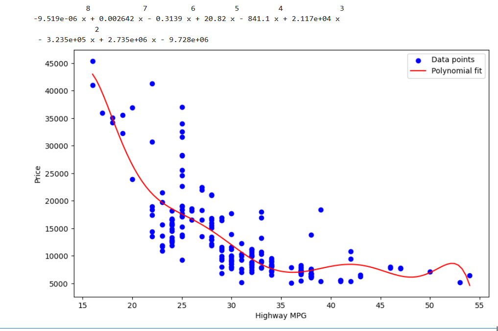
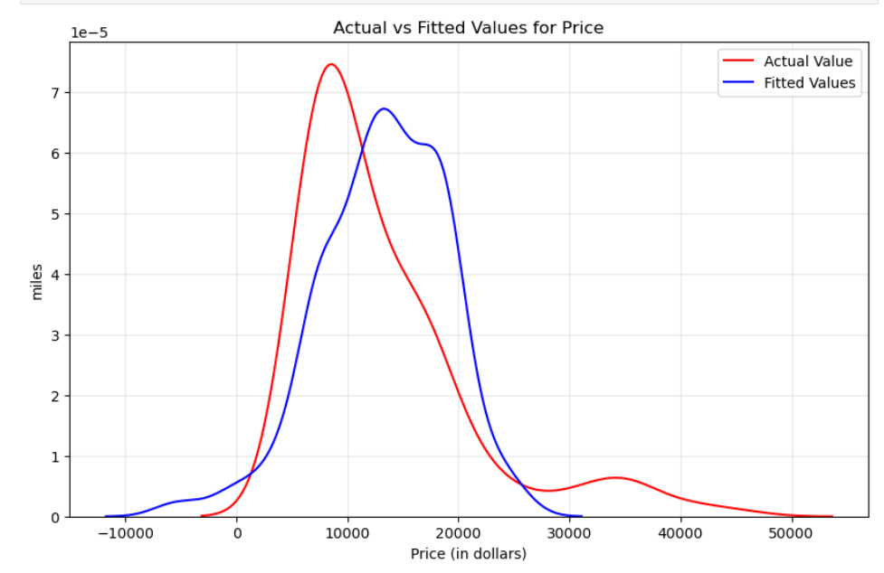
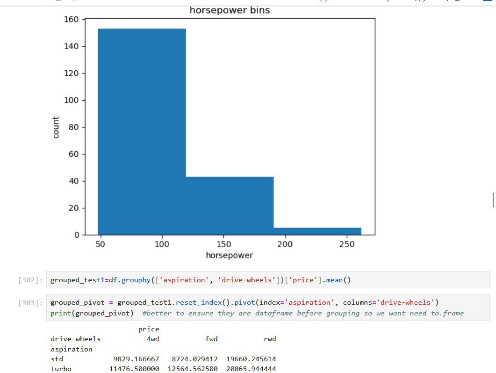

# Car Price Analysis and Prediction

## Overview
This project explores the relationship between different car characteristics and their market prices. 
The goal is to identify which technical factors most influence car pricing using statistical and visual analysis in Python.

The dataset includes attributes such as engine size, horsepower, and highway mileage. 
Exploratory analysis and regression modeling were used to understand trends and predict pricing behavior.

---

## Objectives
- Analyze how engine size and horsepower affect car prices
- Visualize the distribution of horsepower using binning
- Identify correlations between highway mileage and price using regression analysis
- Compare model performance between actual and fitted values

---

## Key Insights

### Horsepower Binning
This histogram represents the distribution of horsepower values and how they are categorized into bins for analysis.

---

### Polynomial Regression Model
A polynomial regression was fitted between highway MPG and car price, showing a non-linear inverse relationship — as fuel efficiency increases, price generally decreases.

---

### Model Evaluation
Comparison between actual and fitted price distributions, highlighting the regression model’s accuracy and fit quality.

---

## Tools Used
- Python (Pandas, NumPy, Matplotlib, Seaborn, Scikit-learn)
- Jupyter Notebook

---

## Results
- Engine size and horsepower were found to have a strong positive correlation with price
- Polynomial regression captured the non-linear patterns effectively
- Visual analysis supported data-driven understanding of vehicle pricing

---

## Author
**Omar Aly**  
📧 [omarehab4472@gmail.com](mailto:omarehab4472@gmail.com)  
🔗 [linkedin.com/in/omar-aly-272105224](https://www.linkedin.com/in/omar-aly-272105224)
