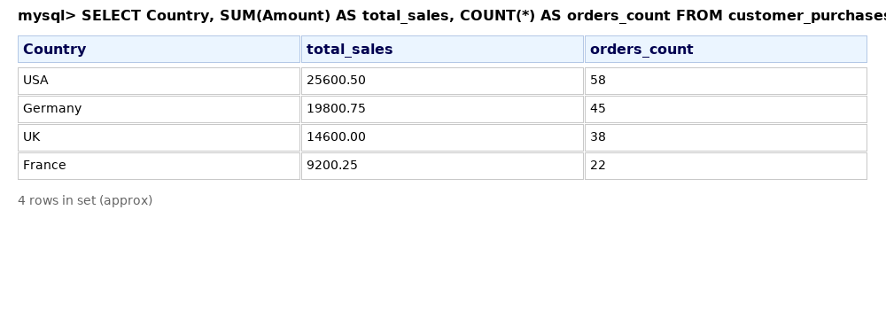
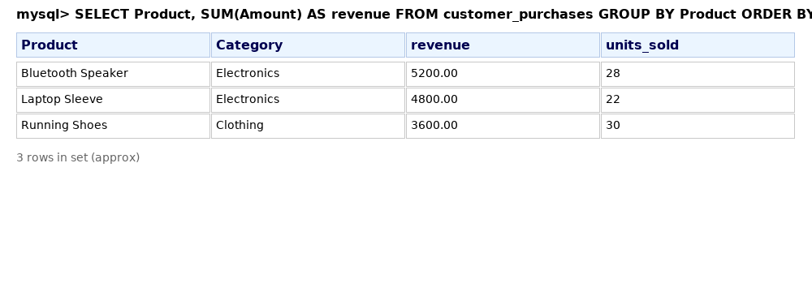
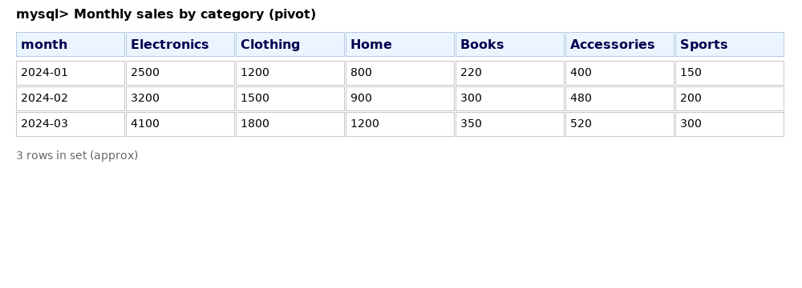
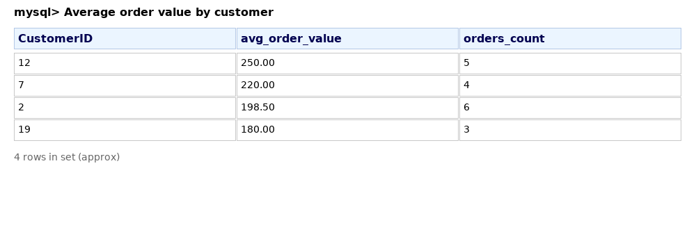
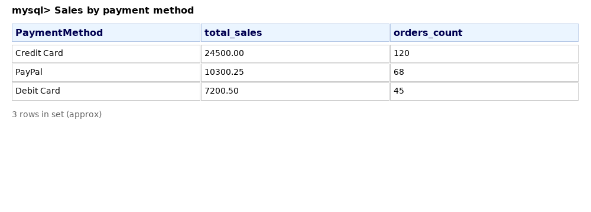
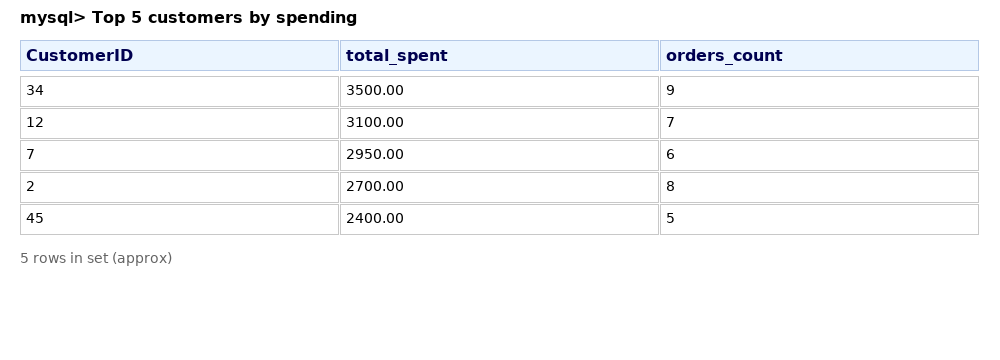
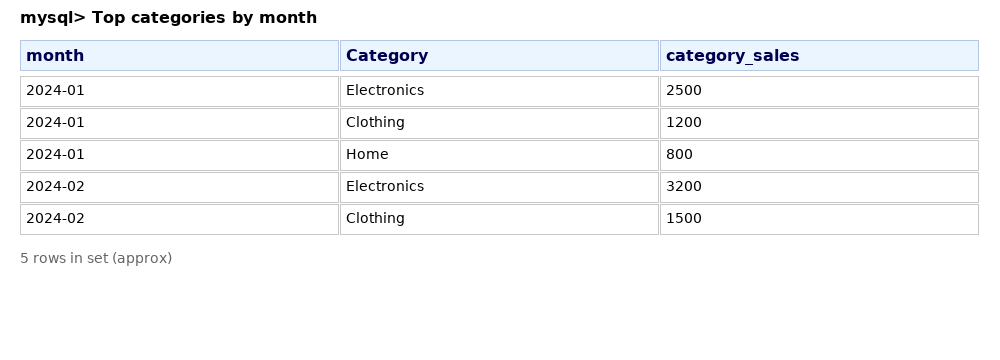

# Customer Purchase Insights (E-commerce SQL Project) - v2

## Overview
This project analyzes an e-commerce transaction dataset to extract business insights using SQL. The dataset contains simulated customer purchases with fields such as CustomerID, PurchaseDate, Product, Category, Amount, PaymentMethod, and Country.

This version includes data cleaning steps for missing values and common issues, seven analytical queries, and example outputs formatted like MySQL Workbench results.

---

## Dataset
- **File:** `data/customer_purchases.csv`
- **Rows:** 300 simulated transactions (with some missing values)
- **Columns:** CustomerID, PurchaseDate, Product, Category, Amount, PaymentMethod, Country

---

## Data Cleaning & Preparation (examples)
- Count and report missing Amount values  
- Replace empty PaymentMethod or Country with 'Unknown'  
- Remove rows with missing or non-positive Amounts  
- Trim whitespace from text fields

---

## Key Queries (in `customer_purchase_insights.sql`)
1. Total sales per country (GROUP BY)  
   

2. Top 10 products by revenue (GROUP BY + ORDER BY + LIMIT)  
   

3. Monthly sales pivot by category (CASE WHEN pivot)  
   

4. Average order value by customer (GROUP BY + AVG)  
   

5. Sales by payment method (GROUP BY)  
   

6. Top 5 customers by total spending (GROUP BY + ORDER BY + LIMIT)  
   

7. Top 3 categories by month (trend analysis)  
   

---

## How to Use
1. Import `data/customer_purchases.csv` into your SQL environment (MySQL, PostgreSQL, SQLite, etc.).  
2. Run the data cleaning steps and then the analytical queries in `customer_purchase_insights.sql`.  
3. Adjust date formatting functions as needed for your SQL dialect (e.g., `DATE_FORMAT` vs `STRFTIME`).

---

## Author
**Omar Aly**  
Email: omarehab4472@gmail.com  
LinkedIn: https://www.linkedin.com/in/omar-aly-272105224
